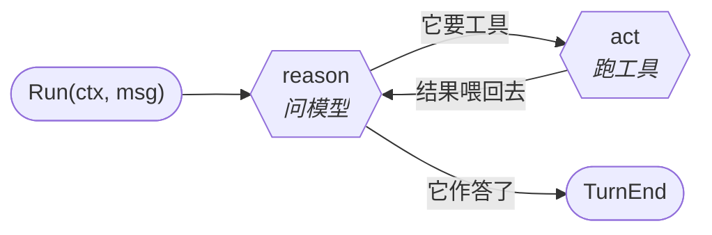
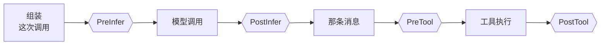
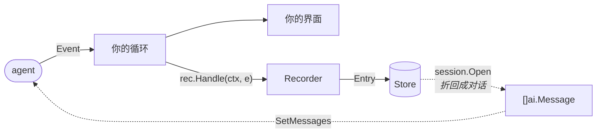

# sdk-go

[](https://pkg.go.dev/github.com/genai-io/sdk-go)
[](https://github.com/genai-io/sdk-go/actions/workflows/ci.yml)
[](go.mod)
[](LICENSE)

一个大模型的 Go SDK，分两个包：在 Anthropic Messages、OpenAI Chat Completions、OpenAI Responses 和 Google Gemini 四种协议之上提供**同一套带类型的 API**，以及一个跑在它外面那圈循环的 agent 运行时。

**`pkg/ai` —— 一次模型调用**

- **一套 API，五种协议** —— 不管哪家服务，拿到的都是同样的类型。
- **流式** —— 文本、thinking、工具调用、图片共用一套 start/delta/end 生命周期。
- **工具调用** —— schema 从你的参数 struct 推导，参数在你的代码运行前先校验。
- **结构化输出** —— `CompleteAs[T]` 推导 schema、约束生成、解码答案。
- **带类型的错误** —— 认证、限流、超上下文、不支持,不是要去匹配的子串。
- **模型目录** —— 27 家厂商、55 个模型；端点、限额、价格都是数据。
- **不会顺手读凭证** —— `pkg/ai` 不读任何环境变量、不读任何文件。

**`pkg/agent` —— 外面那圈循环**

- **reason 与 act** —— 问模型、跑它要的工具、再问一次。
- **一切皆事件** —— 一段序列上 10 种类型，而对话就是其中两种的折叠。
- **四种 hook** —— 拦下一次工具调用、改写发出去的东西、抹掉返回来的东西。
- **并行工具** —— 一批默认并发，除非某个工具说它不能。
- **会话** —— 记录 agent 做过什么，再从中恢复对话。

[安装](#安装) · [English](README.md)

**[客户端](#客户端--pkgai)** —
[快速开始](#快速开始) ·
[流式](#流式) ·
[工具调用](#工具调用) ·
[结构化输出](#结构化输出) ·
[请求选项](#请求选项) ·
[消息与内容](#消息与内容) ·
[错误](#错误与执行策略) ·
[凭证](#凭证) ·
[协议](#支持的协议)

**[Agent](#agent--pkgagent)** —
[循环](#循环) ·
[事件](#一切皆事件) ·
[Hook](#hook) ·
[会话](#会话)

## 安装

```sh
go get github.com/genai-io/sdk-go
```

需要 Go 1.24 或更高版本。

## 客户端 —— `pkg/ai`

一次模型调用，五种协议任选。这一半的所有内容都不依赖 `pkg/agent`。

### 快速开始

```go
package main

import (
	"context"
	"fmt"
	"log"

	"github.com/genai-io/sdk-go/pkg/ai"
	"github.com/genai-io/sdk-go/pkg/ai/auth"

	_ "github.com/genai-io/sdk-go/pkg/ai/driver/openai/responses"
)

func main() {
	client, err := auth.Client("openai/gpt-4.1")
	if err != nil {
		log.Fatal(err)
	}

	response, err := client.Complete(context.Background(),
		[]ai.Message{ai.UserMessage("Explain goroutine leaks.")},
		ai.WithSystem("You are concise."))
	if err != nil {
		log.Fatal(err)
	}
	fmt.Println(response.Text())
}
```

`auth.Client` 会从厂商文档规定的那个环境变量里读凭证——这里是 `OPENAI_API_KEY`。那个空导入注册的是**一种线协议**；只导入你要用的，或者在模型要到运行时才确定时用 `pkg/ai/driver/all`。

这是**一条链的最短端**：`auth.Client` 就是 `auth.Config` 加 `ai.New`，后者又是 `ai.NewDriver` 加 `ai.NewClientWithDriver`。需要的话就早点停——绝不能顺手读凭证的服务端停在 `ai.New`，要套 middleware 就停在 `ai.NewDriver`。见[构造客户端](docs/clients.zh-CN.md)。

#### 换一家服务

**只改引用，其他什么都不用动。**

```go
ref := "anthropic/claude-opus-5" // 或 google/gemini-3.5-flash、
                                 //    deepseek/deepseek-v4-pro、ollama/llama4
client, err := auth.Client(ref)
```

`catalog.Models()` **不联网**就能列出全部 `厂商/模型` 引用。

可直接运行的例子在 [`examples/`](examples)——每家厂商一个，外加 [`tools/`](examples/tools)、[`structured/`](examples/structured) 和四个 agent 例子。

### 流式

`Stream` 返回一个事件迭代器。**每一种内容**——文本、thinking、工具调用、图片——都走同一套 start/delta/end 生命周期，所以一个循环就能全部处理。

```go
for event, err := range client.Stream(ctx, messages) {
	if err != nil {
		return err
	}
	switch event.Type {
	case ai.EventBlockStart:
		ui.Open(event.Index, event.Block.Type)

	case ai.EventBlockDelta:
		switch event.Block.Type {
		case ai.BlockText:
			ui.AppendText(event.Index, event.Block.Text)
		case ai.BlockThinking:
			ui.AppendThinking(event.Index, event.Block.Text)
		}

	case ai.EventBlockEnd:
		if event.Block.Type == ai.BlockToolCall {
			go runTool(*event.Block.ToolCall)
		}

	case ai.EventDone:
		response = event.Response
	}
}
```

`EventBlockDelta` 带**片段**，`EventBlockEnd` 带**完整的块**，`EventDone` 带聚合好的 `Response`——和 `Complete` 返回的是同一个值。**开启的块一定会被关闭，出错时也一样**；中途放弃迭代器会取消请求。

### 工具调用

一个工具就是**一个名字、一句话、一个函数**。struct 里放的正好是模型可以发来的东西。

```go
type SearchArgs struct {
	Query string `json:"query" description:"要找什么，用大白话"`
	Limit int    `json:"limit,omitempty" description:"最多返回几段" maximum:"10"`
}

search := ai.ToolFunc("search", "搜索文档，返回匹配的段落。",
	func(ctx context.Context, a SearchArgs) (string, error) {
		return docs.Search(ctx, a.Query, a.Limit) // 依赖走闭包
	})

response, history, err := client.Run(ctx,
	[]ai.Message{ai.UserMessage(question)}, []ai.Tool{search, fetch})
```

<details>
<summary><code>ToolFunc</code> 是简写。它折叠掉的就是下面这段。</summary>

一个工具就是两半：`Schema` 是模型被告知的全部，`Run` 是应答调用的那部分。
`ToolFunc` 从 `Run` 接受的 Go 类型推导出前者。

```go
search := ai.Tool{
	Schema: ai.Schema{
		Name:        "search",
		Description: "搜索文档，返回匹配的段落。",
		Definition:  jsonschema.For[SearchArgs](),
	},
	Run: func(ctx context.Context, arguments string) (string, error) {
		var a SearchArgs
		if err := (ai.ToolCall{Name: "search", Input: arguments}).UnmarshalArgs(&a); err != nil {
			return "", err
		}
		return docs.Search(ctx, a.Query, a.Limit)
	},
}
```

**`ai.Tool` 就是一个工具的全部**：上线的那个 schema，加一个应答调用的函数。`ToolFunc` 做的事只有两件——从 `SearchArgs` 推出 schema、把参数解码进它。仅此而已：两种写法产出的定义**逐字节相同**，行为也相同，连错误都一样。

所以那些"逃生口"根本不是特性。手写 schema 是一次赋值 `search.Schema.Definition = handWritten`；到运行时才知道形状的工具就是上面这个写法、schema 从别处来。两者都没用到常规路径之外的任何东西。

`UnmarshalArgs` 就是 `ToolFunc` 用来解码的那个，也值得你直接用：**schema 里没有的参数是错误，不是静默丢弃**——模型编出来的东西该被告知，而不是被执行一半；空文档则按空对象读，那正是**无参数的工具，这里每个协议都会发的东西**。

</details>

`Run` 就是模型需要的那个循环：它请求、你回答、它继续。`history` 是整段对话，追问直接从它接着走。

**`SearchArgs` 只写了一次**，所以发给模型的 schema 和参数解码进去的 struct 不可能各说各话：

```json
{
  "type": "object",
  "properties": {
    "query": {"type": "string", "description": "要找什么，用大白话"},
    "limit": {"type": ["integer", "null"], "description": "最多返回几段", "maximum": 10}
  },
  "required": ["query", "limit"],
  "additionalProperties": false
}
```

参数在你的函数运行前先按它校验过，于是**模型的错误会变成它能自己改正的东西**。工具名不存在、参数不对、工具自己失败——都作为 `IsError` 结果回给模型，而不是终止整段对话。

约束模型调哪个，是**一个值、四种状态**，正好是每个协议都能表达的那四种：

```go
ai.WithToolChoice(ai.ToolChoiceNone)            // 这一轮不许调工具
ai.WithToolChoice(ai.ToolChoiceRequired)        // 必须调一个，调哪个模型定
ai.WithToolChoice(ai.ToolChoiceNamed("search")) // 必须调这个
```

轮次本身是你的业务时（要流式输出、要按条件停、要每轮记账），用 `Complete` 加 `RunTools` 自己写这个循环。

### 结构化输出

```go
type Person struct {
	Name string `json:"name" description:"完整法定姓名，姓在后"`
	Age  int    `json:"age" description:"周岁" minimum:"0"`
}

person, err := ai.CompleteAs[Person](ctx, client, messages)
```

**类型只写一次**：`CompleteAs` 从它推导 schema、原生约束生成、再把答案解码回它。

**标签的 key 就是它要设的那个 JSON Schema 关键字**——共 11 个——而且每一个字都是 prompt 文本。schema 是按**"能被接受"**推导的，不只是"合法"，这比规范本身更严。见 [`pkg/ai/jsonschema`](https://pkg.go.dev/github.com/genai-io/sdk-go/pkg/ai/jsonschema)。

### 请求选项

对话就是一个普通的 `[]ai.Message`。其余一切都是 `Option`，而且**同一个 option 在构造时是默认值、在调用处是覆盖值**：

```go
client, err := auth.Client("openai/gpt-4.1", ai.WithEffort(ai.EffortHigh)) // 默认值

response, err := client.Complete(ctx, messages,
	ai.WithTemperature(0),
	ai.WithMaxTokens(4096),
	ai.WithEffort(ai.EffortLow), // 覆盖上面的默认值
	ai.WithCacheRetention(ai.CacheLong))
```

**传了 option 本身就是"显式"的标记**，所以 `WithTemperature(0)` 是确定性采样，不传才是继承。解析顺序：模型默认 → 客户端默认 → 调用处覆盖。

`WithEffort` 是**归一化的档位**。每个模型自带一张梯子，映射到它端点想要的东西——token 预算、级别字符串、开关标志——没有那一档就**贴到最近的一档**。

### 消息与内容

一条消息装的是**有序的、带类型的块序列**，而不是一堆平行字段——因为**下一次请求要重放的正是这个顺序**。

```go
messages := []ai.Message{
	ai.UserMessage("What is in this image?", image),
	ai.AssistantMessage("A gopher."),
	ai.ToolResultsMessage(result),
}

text := response.Text()
history = append(history, response.Message()) // 保留每一个块，保序
```

**工具结果也是内容**：文本，以及协议能带的图片——一张截图、一张渲染出来的图。`Model.Validate` 会在那两个带不了的协议上**拒绝请求**，而不是把图悄悄丢掉、让模型去回答一张它从没看见过的图。

**用 `response.Message()`，不要用 `ai.AssistantMessage(response.Text())`** —— 前者把 thinking 和 reasoning 状态带到下一轮，那正是让推理模型能接着想、而不是每轮从头想的东西。

### 错误与执行策略

失败是**分类过的**，所以"现在该怎么办"的答案在**类型**里，而不在错误文本里：

```go
switch {
case ai.IsAuth(err):            // 凭证不对或缺失
case ai.IsContextExceeded(err): // 压缩对话后重试
case ai.IsRetryable(err):       time.Sleep(ai.RetryAfter(err))
case ai.IsUnsupported(err):     // 这个模型做不了要求它做的事
}
```

失败的一轮会**同时**返回非 nil 的 error 和非 nil 的 `*Response`，装着先到的那部分——**部分答案和它的花费不会跟着错误一起丢掉**。请求发出前就会校验，而且**绝不会被改写成"能跑"**：模型没有 system 角色就报错并指名道姓，因为把那些指令挪进 user 轮是**关于你产品的决定**。

执行策略是装饰 driver 的 `Middleware`：

```go
client := ai.NewClientWithDriver(ai.Wrap(driver, ai.Retry(3, time.Second), costMeter), model)
```

`Retry` 是唯一自带的策略，而且**每个 driver 都关掉了厂商 SDK 自己的重试**——不加它就一次重试都没有。缓存、日志、成本统计都归你。

### 凭证

**`pkg/ai` 永远不读环境变量、不读文件。**正是这一点让它在一台握着多个租户密钥的服务器上是安全的：

```go
client, err := ai.New(ai.Config{
	Model: model, APIKey: key, BaseURL: "https://gateway.internal/v1",
	HTTPClient: httpClient, Headers: map[string]string{"X-Tenant": tenant},
})
```

`pkg/ai/auth` 是那个**选择性开启**、确实会读环境的入口。`pkg/ai/provider` 夹在目录行和客户端之间：一个配好的 host 加上它上面的模型，其中**"读列表"和"拉列表"是两个动词**。

### 支持的协议

| 协议 | 包 | 目录中的厂商数 |
| --- | --- | --- |
| OpenAI Chat Completions | `pkg/ai/driver/openai/chat` | 18 |
| OpenAI Responses | `pkg/ai/driver/openai/responses` | 3 |
| Anthropic Messages | `pkg/ai/driver/anthropic` | 4 |
| Anthropic on Vertex AI | `pkg/ai/driver/anthropic/vertex` | 1 |
| Google Gemini | `pkg/ai/driver/google` | 1 |

**厂商是目录里的一行，不是一个包**：大多数提供的端点说的是别人的协议，所以加一家是改数据。

## Agent —— `pkg/agent`

围绕那一次调用的循环：问模型、跑它要的工具、再问一次。这一半建立在上面那一半之上，
并且**不往里加任何东西**——一个 agent 持有一个 `ai.Client`，调它的 `Stream`。

### 循环

`pkg/ai` 负责一次模型调用。`pkg/agent` 负责它外面那圈循环：问模型、跑它要的工具、再问一次，直到模型不再要东西、直接作答。这整件事叫一个 **turn**，它内部有几次模型调用取决于工具要几轮。



`Run` 把对话**恰好推进一轮**，并把沿途做的事作为序列报出来；最后一个事件是 `TurnEnd`，它说明这一轮怎么结束的。

```go
a, err := agent.New(client,
    agent.WithSystem("You are a careful assistant."),
    agent.WithTools(readFile, listDir),
)
if err != nil {
    log.Fatal(err)
}

for e, err := range a.Run(ctx, ai.UserMessage("main.go 是做什么的?")) {
    render(e)
}
```

**重复它是你的 `for` 循环。** CLI 读 stdin，界面读按键，服务端读请求——这些形状库猜不到，所以消息怎么批成一轮、失败了算什么、什么时候停，全都是你的：

```go
for batch := range myMessages {
    for e, err := range a.Run(ctx, batch...) { render(e) }
}
```

`AddMessages` 把消息塞进**正在跑的那一轮**，`Interrupt`（或者直接 `break` 出 range）结束它。

### 一切皆事件

一段序列上 10 种类型，而且集合是**封闭**的——消费者 switch 的时候可以确信这就是全部。有两样东西有值得跟踪的生命周期，它们的报告方式完全一致：开始、中途可能报告、结束。

```
MessageAdded  MessagesReplaced            对话本身发生变化
MessageStart  MessageUpdate  MessageEnd   模型正在产生一条消息
ToolStart     ToolUpdate     ToolEnd      一次工具调用，从提出到答复
TurnStart                    TurnEnd      包住它们的那一轮
```

**对话是第一行的折叠。** 把 `MessageAdded` 按顺序重放，得到的就是 agent 手里那份；遇到 `MessagesReplaced` 就从头开始折，因为在它之前的都是 agent 已经扔掉的。会话要存的只有这些，恢复要读的也只有这些。

**每个事件都带着自己属于哪一轮，每个收尾事件都带着开启它的东西**——所以读一个事件是"读"，不是"回忆"。

### Hook

四个可以插进循环和模型之间的位置。**hook 是征询，事件是通知。**



一套权限系统，就是一个返回 `Decision{Block: true}` 的 `PreTool`。一批工具调用默认并发执行，除非某个工具声明自己不能；工具 panic 也按普通失败处理——告诉模型，这一轮继续。

重试归 client：`ai.Retry` 包在 driver 外面，所以 agent 默认一次都不重试——两份预算是相乘不是相加。

### 会话

会话是这条事件流的**消费者**，不住在 agent 内部。你的循环喂给它，而 agent 从头到尾不知道有存储这回事。



```go
rec, history, _ := session.Open(ctx, store, id)   // 恢复
a.SetMessages(history)                            // 喂给 agent
for e, err := range a.Run(ctx, ai.UserMessage(line)) {
    rec.Handle(ctx, e)                            // 记录，在你自己的循环里
    render(e)
}
```

压缩不需要第四行：**换掉对话本身也是一个事件**，消费了这条流的会话已经知道了。

事件契约、hook 的组合规则、工具与会话，见 [Agent SDK](docs/agent.zh-CN.md)；
能直接跑的程序见 [`examples/agent-chat`](examples/agent-chat)、[`examples/agent-progress`](examples/agent-progress)、
[`examples/agent-session`](examples/agent-session) 和 [`examples/agent`](examples/agent)。

## 文档

| | |
| --- | --- |
| [API 参考](https://pkg.go.dev/github.com/genai-io/sdk-go/pkg/ai) | 每个类型和函数，设计理由就写在它管辖的代码旁边 |
| [构造客户端](docs/clients.zh-CN.md) | 从模型引用到 `ai.Client` 的一条链，以及在哪里停下（[English](docs/clients.md)） |
| [架构](docs/architecture.zh-CN.md) | 各部分如何拼合，一个请求要经过什么（[English](docs/architecture.md)） |
| [Agent SDK](docs/agent.zh-CN.md) | 结构、事件契约、hook、工具与会话（[English](docs/agent.md)） |
| [贡献指南](CONTRIBUTING.md) | 开发环境、实现一套协议、测试套件 |
| [更新日志](CHANGELOG.md) | 每个版本改了什么 |
| [`examples/`](examples) | 可运行的程序：每家厂商一个，外加工具调用、结构化输出和四个 agent |

## 版本

遵循[语义化版本](https://semver.org/lang/zh-CN/)。主版本号还是 `0`，所以 API 在次版本之间仍可能变动；[更新日志](CHANGELOG.md)会写清楚动了什么、该改成什么。

```sh
go get github.com/genai-io/sdk-go@v0.2.0
```

## 许可

[Apache 2.0](LICENSE)
