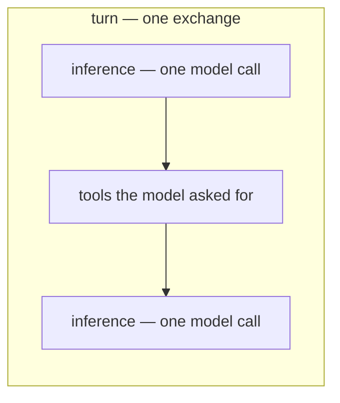
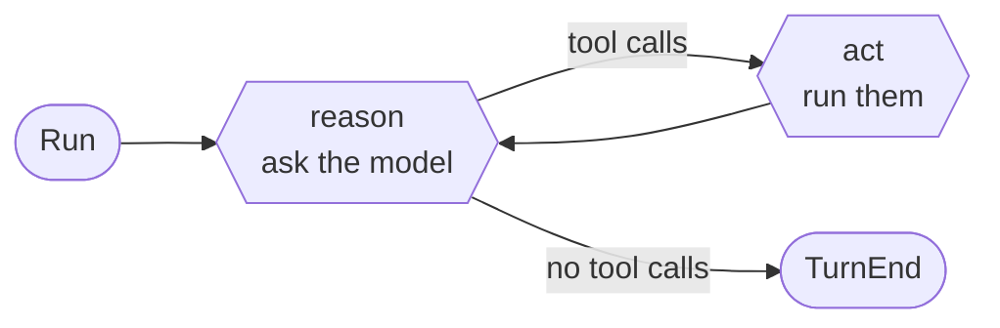
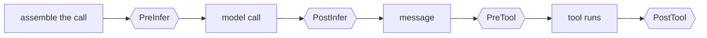
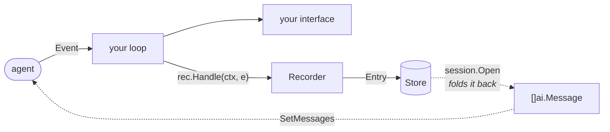

# The Agent SDK

`pkg/ai` makes one model call. `pkg/agent` runs the loop around it: call the
model, run the tools it asks for, call it again, and report everything on the
way as events.

An agent advances **one exchange at a time**, reporting what it does as a
sequence:

```go
a, err := agent.New(client,
    agent.WithSystem("You are a careful assistant."),
    agent.WithTools(readFile, listDir),
)

for e, err := range a.Run(ctx, ai.UserMessage("what changed in main.go?")) {
    render(e)
}
```

The last event is `TurnEnd`, which carries how the exchange went and the
message the model produced — so a caller with nothing to render keeps that one
and ignores the rest.

Repeating it is a `for` loop, and the loop is the application's — how messages
are batched into exchanges, what a failure means, when to stop:

```go
for batch := range myMessages {
    for e, err := range a.Run(ctx, batch...) { render(e) }
}
```

A CLI reads stdin, an interface reads keys, a server reads requests, and none
of those is a shape this package can guess. `AddMessages` puts something into
the exchange in flight — it arrives at the next step boundary, which is the
only place changing what the model is about to see is safe. `Interrupt`, or
breaking out of the range, ends it instead.

Events arrive on the ranging goroutine, so an agent that must run ahead of a
slow reader is one whose caller forwards them to a buffer of its own — how
deep, and what to drop when it fills, being theirs to decide.

## Two levels, two words

Both words are used precisely, because agent frameworks disagree about them:



| | |
| --- | --- |
| **turn** | one exchange: someone said something, and the loop runs until the model stops asking for tools |
| **inference** | one model call, of which a turn holds as many as the tools require |

A turn is *not* a model call. That is the distinction most of the vocabulary
here rests on.

## The loop: reason and act



`reason` makes one model call and returns the message it produced. If that
message asks for tools, `act` vets the batch, runs what survives, and feeds the
results back. When the model answers without asking for anything, the turn ends.

Five ways a turn can end, and every exit names one:

| `StopReason` | |
| --- | --- |
| `end_turn` | the model answered without asking for a tool |
| `max_tokens` | the model ran out of output room mid-answer — the reply is not whole |
| `refusal` | the model declined, or a content filter stopped it — there may be text, it is not the answer |
| `stop_sequence` | generation stopped at one of `WithStopSequences` |
| `max_steps` | the step budget ran out with the model still working |
| `terminated` | every tool in a batch asked the loop to stop |
| `error` | a model call failed past its retry budget, or a hook refused |
| `canceled` | the context ended mid-exchange, or `Interrupt` was called |

### Ending one early

A stream that says nothing is the one failure that looks like work, so an
agent bounds it: `WithStreamTimeout(first, idle)` caps how long the endpoint
may take to say anything and how long it may pause once it has started, on by
default at five minutes and one minute. Running out is reported as a network
failure — because it is one — and it is one of the two things `WithRetry` is
for.

### Retry belongs to the client

`ai.Retry(attempts, backoff)` wraps the driver and is where retry goes. The
agent does not retry by default, because two budgets multiply rather than add:
three attempts here on a client already wrapped in `ai.Retry(3, …)` is nine
model calls for one step, and neither loop can see the other's count.

`WithRetry(attempts, backoff)` turns on a second budget deliberately, for the
two failures the client cannot replay: a stream that already yielded output —
`ai.Retry` gives up there, because its caller has seen it, where this loop
discards the attempt and opens a new message — and a stalled stream, since
ending one cancels the context `ai.Retry` would wait on. Either way the wait
honours the endpoint's `Retry-After` before its own backoff.

`Interrupt()` ends the exchange in flight and leaves the agent alive: the turn
stops with `StopCanceled`, `Run` returns, and the next one starts clean. That
is what a user pressing escape asks for. Cancelling `Run`'s own context is the
other thing, and ends everything.

## Events

Everything the agent does arrives as one of ten types. Two things have a life
worth following — a message and a tool call — and each is reported the same
way: it starts, it may report as it goes, it ends.

```
MessageAdded  MessagesReplaced            the conversation changing
MessageStart  MessageUpdate  MessageEnd   the model producing a message
ToolStart     ToolUpdate     ToolEnd      a tool call, asked to answered
TurnStart                    TurnEnd      the exchange around them
```

The set is closed — the `event()` method is unexported, so no other package can
add to it — and a consumer switches over it knowing that list is all there is.

**The conversation is the fold of the first row.** Replay `MessageAdded` in
order and you have what the agent holds; a `MessagesReplaced` starts the fold
over, because everything announced before one is what the agent threw away.
Everything else reports work in progress.

Every event that belongs to a turn carries its number, and every event that
closes a span carries what opened it — `MessageEnd` its request, `ToolEnd` its
name and arguments. A consumer reads what happened off the event rather than
rebuilding it from what came before, which is why recording one is a
translation and not a state machine.

One exchange, from the outside:


### A retry needs no event of its own

When a stream fails retryably, the attempt ends with a `MessageEnd` carrying
the error and another `MessageStart` follows with `Attempt` incremented. **No
`MessageAdded` comes between them** — and that absence is what tells a consumer
the partial output it drew is void.

```
MessageStart(attempt=1) → MessageEnd(err) → MessageStart(attempt=2) → … → MessageEnd → MessageAdded
```

### Nothing is dropped

There is no reader to fall behind: the events arrive on the ranging goroutine,
so the agent waits for the body of the loop. A caller who cannot afford to hold
it up forwards to a buffer of its own — and **how deep it is, and what to drop
when it fills, are the caller's to decide**, which is the only place that
decision can be made with enough information.

One exception, and it is the one place something really does cross goroutines:
what a tool reports while it works comes from the tool's own goroutine, and is
dropped rather than stalling the tool for it. `ToolEnd` carries the finished
result either way.

## Hooks

Hooks are how an application gets between the loop and the model. Events are
told; hooks are *asked* — that is why they share no word with the event stream.



| | in | out |
| --- | --- | --- |
| `PreInfer` | the call, about to go | edits it in place |
| `PostInfer` | the response, on a call that worked | edits it in place |
| `PreTool` | the call, its tool, the conversation | a `Decision` |
| `PostTool` | the call, its tool, what it produced | a `*Result` (nil keeps it) |

```go
agent.WithHooks(agent.Hook{
    PreTool: func(ctx context.Context, c agent.PreToolContext) (agent.Decision, error) {
        if c.Tool.Schema().Name == "write_file" && !approved(c.Call) {
            return agent.Decision{Block: true, Reason: "not approved by the user"}, nil
        }
        return agent.Decision{}, nil
    },
})
```

**Composition rules**, because two gates that disagree need one:

- All but `PreTool` chain: each sees what the one before it left.
- `PreTool` is asked in order and **the first refusal is final**. A gate that
  gets weaker as you add to it is not a gate.
- Every hook runs on the loop's goroutine, one at a time, so none needs locking
  of its own.
- An error from any of them ends the exchange.

An agent holds several hooks, not one: a permission gate and an audit log are
different concerns and should not have to be the same function.

### What `PreInfer` may change

`PreInfer` is handed an `Inference` — the call this agent is about to make —
and edits last, for that one call:

```go
PreInfer: func(_ context.Context, inf *agent.Inference) error {
    if len(inf.Messages) > 200 {
        inf.Messages = inf.Messages[len(inf.Messages)-200:]
    }
    inf.Options = append(inf.Options, ai.WithForceTool("search"))
    return nil
},
```

`System`, `Messages` and `Tools` are what the agent contributes, and the hook
owns them for the call. Everything else a model call can carry — a forced tool
for this step, a schema for this answer, a cap on these tokens, a protocol's
own setting — is reached by appending to `Options`, which is layered on last,
over the client's.

It is that shape and not an `ai.Request` for a reason. A request handed over
half-filled cannot say which fields were meant: for every value type on it,
*left alone* and *deliberately set to zero* are the same bytes — the ambiguity
`ai.Request.Temperature` is a pointer to avoid. An appended option has no such
problem, and layering is how `pkg/ai` composes a call to begin with.

To change the agent itself rather than one call, use `SetMessages`, `SetTools`,
`SetSystem`.

## Tools

A tool is two methods:

```go
type Tool interface {
    Schema() ai.Schema
    Run(ctx context.Context, call ai.ToolCall) (Result, error)
}
```

`ToolFunc` builds one from a Go argument type — the schema the model is sent is
derived from the same struct the arguments decode into, so the two cannot come
to describe different things:

```go
readFile := agent.ToolFunc("read_file", "Read a file from the working tree.",
    func(ctx context.Context, args struct {
        Path string `json:"path" description:"the path to read"`
    }) (agent.Result, error) {
        b, err := os.ReadFile(args.Path)
        if err != nil {
            return agent.Result{}, err
        }
        return agent.TextResult(string(b)), nil
    })
```

Returning an error is how a tool fails: the loop turns it into a tool error the
model can see and correct, rather than failing the turn.

**A tool that takes a while shows its work.** `agent.Report(ctx, partial)`
reaches the consumer as `ToolUpdate` — the output of a command as it arrives,
a file list as it is walked. It comes through the context rather than a
parameter so that a tool with nothing to report pays nothing for it.

**`Result` keeps two audiences apart.** `Content` is what the model is told;
`Details` is what the interface shows and the model never sees — a diff, a file
list, an exit code. A tool that formats for a person ends up sending that
formatting to the model, and paying for it every turn thereafter.

**Parallelism.** A batch runs concurrently by default. `agent.Sequential(t)`
marks a tool that must not run beside others, and one of them in a batch makes
the whole batch run one at a time — a batch is only safe to parallelize if
every member of it is.

**Two orders are in play in a parallel batch, and neither gives way.**
`ToolEnd` is emitted as each tool finishes, so an interface can retire that
spinner the moment it stops; the results handed back to the model go in the
order it asked for them, so replaying a session produces the same transcript
every time.

### Ending a turn from a tool

`Result.Terminate` ends the turn after this batch instead of showing the
results to the model. It is a **vote**: the turn ends only if every call in the
batch asks. One tool cannot cut short a turn whose others are still working —
their results would go into the conversation and never be read. A gate votes
the same way with `Decision.Terminate`.

## Sessions

The agent knows nothing about storage. Recording happens in the application's
own event loop:

```go
rec, history, err := session.Open(ctx, store, resume)   // "" starts a new one
a.SetMessages(history)

for e, err := range a.Run(ctx, msg) {
    rec.Handle(ctx, e)   // write first
    render(e)       // then paint
}
```

That order matters: a process killed between them should not leave a message on
the screen that is not in the file.



Solid arrows are the write path, dotted the read path. They meet nowhere inside
the agent: it is handed a `[]ai.Message` and never learns where it came from.

### What is written

A span is stored once, when it closes — the closing event already carried the
whole value, so nothing needs to be held open and fragments are not stored at
all.

| event | entry | why |
| --- | --- | --- |
| `MessageAdded` | `message` | the conversation, one message at a time |
| `MessagesReplaced` | `snapshot` | the conversation, thrown away and replaced |
| `MessageEnd` | `inference` | one model call: what was asked, what it cost |
| `ToolEnd` | `tool` | one tool execution |
| `TurnEnd` | `outcome` | how the turn ended, and why |
| `MessageStart` `MessageUpdate` `ToolStart` `ToolUpdate` `TurnStart` | — | the closing event says it all |

### What is read

Restoring folds the entries back. Messages append; **a snapshot starts the fold
over**, because everything announced before one is what the agent discarded:

```
seq   1         2         3          4         5         6
      message   message   snapshot   message   message   outcome
                          ▲
                          └─ the fold starts here. 1 and 2 are gone:
                             reading them back would hand the agent
                             the history compaction just removed.
```

Entries other than `message` and `snapshot` are not read to restore — they are
there to explain and to bill. The turn number on each is the session's own, not
the agent's: an agent counts from one on every run, and `session.Open` adds what
the session already held so the two agree.

**Replacing the conversation is an event too.** Compaction swaps the whole
history, and a fold over `MessageAdded` alone would hand back what was thrown
away. So `SetMessages` is announced — as `MessagesReplaced`, at the start of
the next exchange, which is when the agent next has anywhere to say it — and
the recorder stores it as the point a fold starts from:

```go
summary := compact(a.Messages())
a.SetMessages(summary)   // that is the whole of it
```

There is no second line to forget. Announcing it at the next exchange rather
than at the call means a process that dies between the two restores the
conversation as it stood before compaction — which is a lost optimisation, not
a broken history.

`Store` is four methods, and deliberately no more:

```go
type Store interface {
    Create(ctx context.Context, meta Meta) (Meta, error)
    Append(ctx context.Context, id string, entries ...Entry) error
    Entries(ctx context.Context, id string) iter.Seq2[Entry, error]
    Meta(ctx context.Context, id string) (Meta, error)
}
```

Listing, renaming, forking and deleting are the application's business with the
store it chose, and live on that store's own type — `jsonl.Store` has them. An
interface only has to name what this package calls.

## Package layout

```
pkg/agent/
  agent.go     what an agent is: state, options, what you can read and set
  run.go       an exchange: Run, and the reason-and-act loop behind it
  event.go     the nine events
  hook.go      the four hooks, and how each chain runs
  tool.go      Tool, Result, ToolFunc, Sequential
  session/     events → durable entries, and back
    jsonl/     a store on the filesystem, a directory per session
```

## What it does not do

- **No agent-to-agent handoff.** An agent is one conversation with one model.
  Composing several is the application's business, and its event streams are
  already the seam to do it on.
- **No prompt assembly.** `WithSystem` takes a string, because layering sections
  is an application concern this package needs no opinion on.
- **No ambient credentials.** Inherited from `pkg/ai`: nothing is read from the
  environment or from a file unless you asked for it.
- **No compaction policy.** `SetMessages` is the seam; when to use it, and what
  to keep, is yours.
