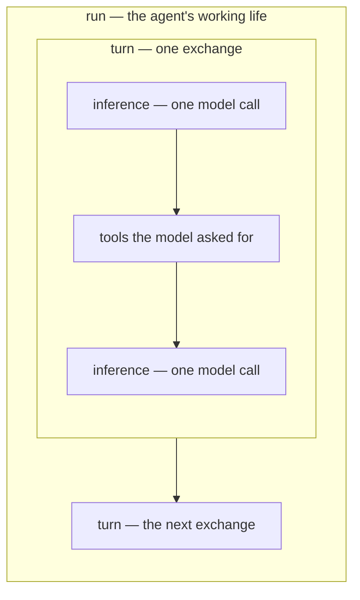
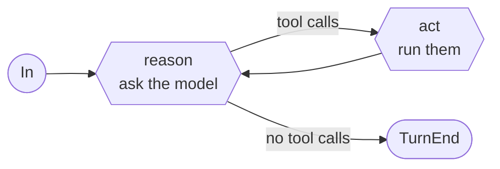
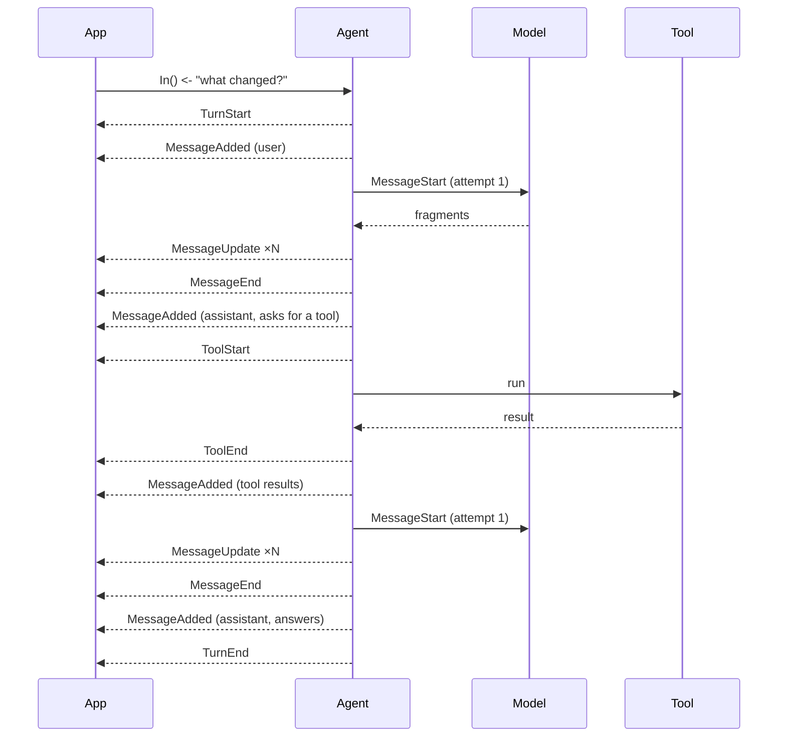
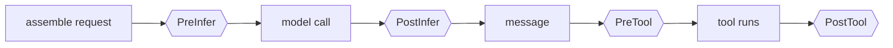
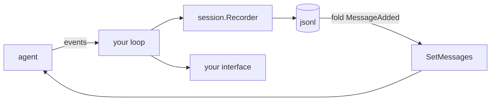

# The Agent SDK

`pkg/ai` makes one model call. `pkg/agent` runs the loop around it: call the
model, run the tools it asks for, call it again, and report everything on the
way as events.

An agent is **a loop and two channels** — what comes in, what goes out:

```go
a, err := agent.New(client,
    agent.WithSystem("You are a careful assistant."),
    agent.WithTools(readFile, listDir),
)

go a.Run(ctx)

a.In() <- ai.UserMessage("what changed in main.go?")
close(a.In())

for e := range a.Out() {
    render(e)
}
```

`Run` is the only way to drive it. There is no second entry point that skips
the event channel — which is what keeps a session store from silently recording
nothing because the caller reached for the other one.

## Three levels, three words

The words are used precisely, because agent frameworks disagree about them:



| | |
| --- | --- |
| **run** | the loop's whole life, across as many exchanges as arrive on `In` |
| **turn** | one exchange: someone said something, and the loop runs until the model stops asking for tools |
| **inference** | one model call, of which a turn holds as many as the tools require |

A turn is *not* a model call. That is the distinction most of the vocabulary
here rests on.

## The loop: reason and act



`reason` makes one model call and returns the message it produced. If that
message asks for tools, `act` vets the batch, runs what survives, and feeds the
results back. When the model answers without asking for anything, the turn ends.

Five ways a turn can end, and every exit names one:

| `StopReason` | |
| --- | --- |
| `end_turn` | the model answered without asking for a tool |
| `max_steps` | the step budget ran out with the model still working |
| `terminated` | every tool in a batch asked the loop to stop |
| `error` | a model call failed past its retry budget, or a hook refused |
| `canceled` | the context ended mid-exchange |

## Events

Everything the agent does arrives on `Out()` as one of eleven types. Two things
have a life worth following — a message and a tool call — and each is reported
the same way: it starts, it may report as it goes, it ends.

```
MessageAdded                              a message entered the conversation
MessageStart  MessageUpdate  MessageEnd   the model producing one
ToolStart     ToolUpdate     ToolEnd      a tool call, asked to answered
RunStart                     RunEnd       the agent's working life
TurnStart                    TurnEnd      one exchange within it
```

The set is closed — the `event()` method is unexported, so no other package can
add to it — and a consumer switches over it knowing that list is all there is.

**The conversation is the fold of `MessageAdded`.** That is the one rule a
consumer needs: replay those in order and you have exactly what the agent
holds. Everything else reports work in progress.

One exchange, from the outside:



### A retry needs no event of its own

When a stream fails retryably, the attempt ends with a `MessageEnd` carrying
the error and another `MessageStart` follows with `Attempt` incremented. **No
`MessageAdded` comes between them** — and that absence is what tells a consumer
the partial output it drew is void.

```
MessageStart(attempt=1) → MessageEnd(err) → MessageStart(attempt=2) → … → MessageEnd → MessageAdded
```

### Only fragments are dropped

`MessageUpdate` and `ToolUpdate` are discarded when a reader falls behind,
because the event closing each span carries the complete value and a consumer
that missed fragments converges anyway. **Everything else waits.** Dropping any
of it would leave the consumer holding a different conversation than the agent
does.

A reader that cannot afford to hold the agent up forwards each event to a
buffer of its own, making the drop policy theirs.

## Hooks

Hooks are how an application gets between the loop and the model. Events are
told; hooks are *asked* — that is why they share no word with the event stream.



| | in | out |
| --- | --- | --- |
| `PreInfer` | the request, about to go | edits it in place |
| `PostInfer` | the response, on a call that worked | edits it in place |
| `PreTool` | the call, its tool, the conversation | a `Decision` |
| `PostTool` | the call, its tool, what it produced | a `*Result` (nil keeps it) |

```go
agent.WithHooks(agent.Hook{
    PreTool: func(ctx context.Context, c agent.PreToolContext) (agent.Decision, error) {
        if c.Tool.Definition().Name == "write_file" && !approved(c.Call) {
            return agent.Decision{Block: true, Reason: "not approved by the user"}, nil
        }
        return agent.Decision{}, nil
    },
})
```

**Composition rules**, because two gates that disagree need one:

- All but `PreTool` chain: each sees what the one before it left.
- `PreTool` is asked in order and **the first refusal is final**. A gate that
  gets weaker as you add to it is not a gate.
- Every hook runs on the loop's goroutine, one at a time, so none needs locking
  of its own.
- An error from any of them ends the exchange.

An agent holds several hooks, not one: a permission gate and an audit log are
different concerns and should not have to be the same function.

### What `PreInfer` may change

`PreInfer` is handed the request this agent assembled — its prompt, its
conversation, its tools — and edits last for that one call. Prune the history,
narrow the toolset for one question, add a line to the prompt that is only true
right now. To change the agent itself, use `SetMessages`, `SetTools`,
`SetSystem`.

The client's own settings — temperature, token ceilings, effort — belong to the
`ai.Client` it was built on, and writing them here changes nothing. One call,
one place to configure it.

## Tools

A tool is two methods:

```go
type Tool interface {
    Definition() ai.Tool
    Run(ctx context.Context, call ai.ToolCall, emit func(Result)) (Result, error)
}
```

`ToolFunc` builds one from a Go argument type — the schema the model is sent is
derived from the same struct the arguments decode into, so the two cannot come
to describe different things:

```go
readFile := agent.ToolFunc("read_file", "Read a file from the working tree.",
    func(ctx context.Context, args struct {
        Path string `json:"path" description:"the path to read"`
    }, emit func(agent.Result)) (agent.Result, error) {
        b, err := os.ReadFile(args.Path)
        if err != nil {
            return agent.Result{}, err
        }
        return agent.TextResult(string(b)), nil
    })
```

Returning an error is how a tool fails: the loop turns it into a tool error the
model can see and correct, rather than failing the turn.

**`Result` keeps two audiences apart.** `Content` is what the model is told;
`Details` is what the interface shows and the model never sees — a diff, a file
list, an exit code. A tool that formats for a person ends up sending that
formatting to the model, and paying for it every turn thereafter.

**Progress** goes out as `ToolUpdate` through the `emit` callback, and never
blocks the tool that sent it.

**Parallelism.** A batch runs concurrently by default. `agent.Sequential(t)`
marks a tool that must not run beside others, and one of them in a batch makes
the whole batch run one at a time — a batch is only safe to parallelize if
every member of it is.

**Two orders are in play in a parallel batch, and neither gives way.**
`ToolEnd` is emitted as each tool finishes, so an interface can retire that
spinner the moment it stops; the results handed back to the model go in the
order it asked for them, so replaying a session produces the same transcript
every time.

### Ending a turn from a tool

`Result.Terminate` ends the turn after this batch instead of showing the
results to the model. It is a **vote**: the turn ends only if every call in the
batch asks. One tool cannot cut short a turn whose others are still working —
their results would go into the conversation and never be read. A gate votes
the same way with `Decision.Terminate`.

## Sessions

The agent knows nothing about storage. Recording happens in the application's
own event loop:

```go
rec, history, err := session.Open(ctx, store, resume)   // "" starts a new one
a.SetMessages(history)

for e := range a.Out() {
    rec.Handle(e)   // write first
    render(e)       // then paint
}
```

That order matters: a process killed between them should not leave a message on
the screen that is not in the file.



A `Recorder` writes a span once, when it closes: `MessageStart`+`MessageEnd`
become one inference entry, `ToolStart`+`ToolEnd` one tool entry. `MessageAdded`
is stored on its own, and folding those back is what restore is. Fragments are
not stored — the closing event already carried the whole value.

`Store` is four methods, and deliberately no more:

```go
type Store interface {
    Create(ctx context.Context, meta Meta) (Meta, error)
    Append(ctx context.Context, id string, entries ...Entry) error
    Entries(ctx context.Context, id string) iter.Seq2[Entry, error]
    Meta(ctx context.Context, id string) (Meta, error)
}
```

Listing, renaming, forking and deleting are the application's business with the
store it chose, and live on that store's own type — `jsonl.Store` has them. An
interface only has to name what this package calls.

## Package layout

```
pkg/agent/
  agent.go     what an agent is: state, options, what you can read and set
  run.go       one run: Run, emit, add
  turn.go      one turn: reason, act, and the loop between them
  event.go     the eleven events
  hook.go      the four hooks, and how each chain runs
  tool.go      Tool, Result, ToolFunc, Sequential
  session/     events → durable entries, and back
    jsonl/     a store on the filesystem, a directory per session
```

## What it does not do

- **No agent-to-agent handoff.** An agent is one conversation with one model.
  Composing several is the application's business, and its event streams are
  already the seam to do it on.
- **No prompt assembly.** `WithSystem` takes a string, because layering sections
  is an application concern this package needs no opinion on.
- **No ambient credentials.** Inherited from `pkg/ai`: nothing is read from the
  environment or from a file unless you asked for it.
- **No compaction policy.** `SetMessages` is the seam; when to use it, and what
  to keep, is yours.
