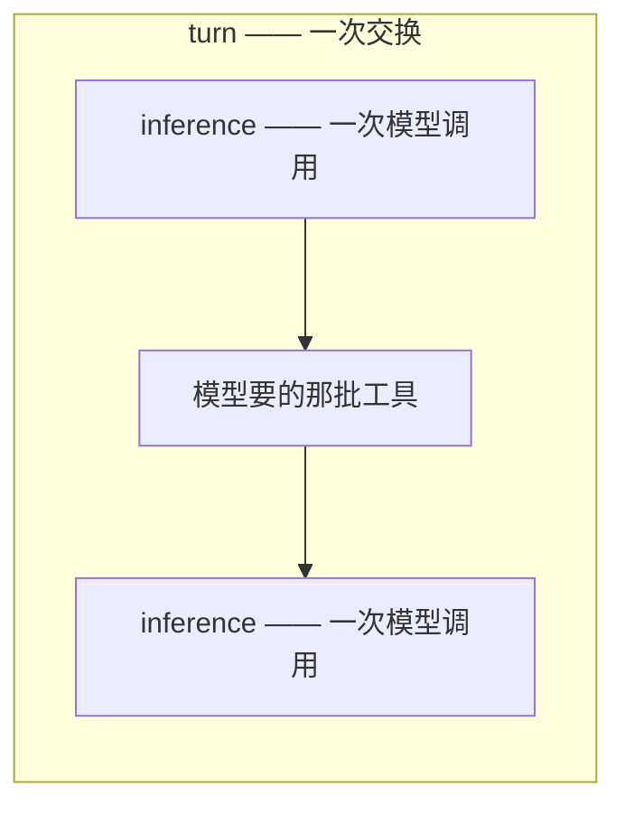
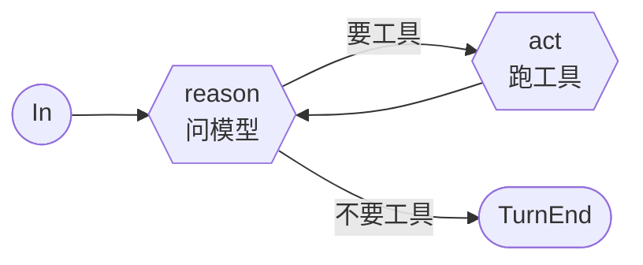
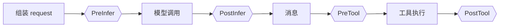
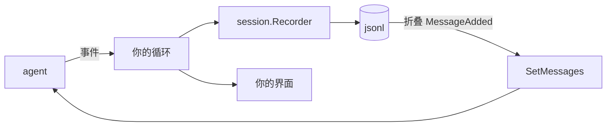

# Agent SDK

`pkg/ai` 负责一次模型调用。`pkg/agent` 负责它外面那圈循环:问模型、跑它要的工具、再问一次,并把沿途发生的每件事作为事件报出来。

一个 agent **一次推进一轮**,并把沿途做的事作为序列报出来:

```go
a, err := agent.New(client,
    agent.WithSystem("You are a careful assistant."),
    agent.WithTools(readFile, listDir),
)

for e, err := range a.Stream(ctx, ai.UserMessage("main.go 改了什么?")) {
    render(e)
}
```

`Turn` 把它折叠成结果,给要答案不要过程的调用方——和 `pkg/ai` 低一层的那对动词完全一致,那边 `Complete` 就是 `Collect(Stream)`:

```go
out, err := a.Turn(ctx, ai.UserMessage(task))
```

**消息进来的那个循环是应用的**:CLI 读 stdin,界面读按键,服务端读请求——这些形状这个包猜不到。`Inject` 把一条消息交给正在跑的那一轮,它在下一个 step 边界落地,那是**唯一安全改变模型即将看到什么的位置**。

事件在 range 那条 goroutine 上到达,所以想让 agent 跑在慢读者前面的调用方,自己转发到自己的缓冲里——**多深、满了丢什么,由它决定**。`break` 出 range 就结束这一轮,和 `Interrupt` 一回事。

## 两个层级,两个词

这两个词是精确使用的,因为各家 agent 框架对它们的用法互相矛盾:



| | |
| --- | --- |
| **turn** | 一次交换:有人说了句话,循环一直跑到模型不再要工具为止 |
| **inference** | 一次模型调用;一个 turn 里有多少次,取决于工具要几轮 |

**一个 turn 不等于一次模型调用。** 这里大部分词汇的分野都建立在这个区别上。

## 循环:reason 与 act



`reason` 做一次模型调用,返回它产出的消息。如果这条消息在要工具,`act` 就审查这一批、跑下活着的、把结果喂回去。模型不再要东西、直接作答时,turn 结束。

turn 有五种结束方式,**每个出口都必须说出是哪一种**:

| `StopReason` | |
| --- | --- |
| `end_turn` | 模型直接作答,没要工具 |
| `max_tokens` | 模型的输出配额用完了,**回答是半截的** |
| `max_steps` | 步数预算用完,模型还在干活 |
| `terminated` | 这一批工具**全体**要求停 |
| `error` | 模型调用重试到底仍失败,或某个 hook 拒绝 |
| `canceled` | 交换进行中 context 断了,或者调了 `Interrupt` |

### 提前结束一个 turn

**一个什么都不说的流,是唯一一种"看起来像在干活"的故障**,所以 agent 给它设了界:`WithStreamTimeout(first, idle)` 限定端点开口说第一句话的时限、以及开口之后可以停顿多久,默认开启,分别是五分钟和一分钟。超时会被报成**网络错误**——它本来就是——然后像其他网络错误一样重试。

`Interrupt()` 结束正在进行的交换,**但让 run 活着**:这个 turn 以 `StopCanceled` 收尾,agent 回到 `In` 上继续等。这就是用户按 ESC 想要的效果。取消 `Run` 自己的 context 是另一回事,那会结束一切。

## 事件

agent 干的每件事都以 9 种类型之一出现。**有两样东西有值得跟踪的生命周期**——一条消息,一次工具调用——它们的报告方式完全一致:开始、中途可能报告、结束。

```
MessageAdded                              一条消息进了对话
MessageStart  MessageUpdate  MessageEnd   模型正在产生一条
ToolStart                    ToolEnd      一次工具调用,从提出到答复
TurnStart                    TurnEnd      包住它们的那一轮
```

这个集合是**封闭**的——`event()` 方法不可导出,别的包加不进来——所以消费者 switch 的时候可以确信上面这张表就是全部。

**对话是 `MessageAdded` 的折叠。** 这是消费者唯一需要记住的规则:把它们按顺序重放,得到的就是 agent 手里那份。其余事件报告的都是过程。

一次交换,从外面看:


### 重试不需要自己的事件

可重试的流失败时,这次尝试以带着错误的 `MessageEnd` 收尾,接着是 `Attempt` 加一的下一个 `MessageStart`。**两者之间没有 `MessageAdded`**——这个"没有"正是告诉消费者:你画出来的那些半截内容作废了。

```
MessageStart(attempt=1) → MessageEnd(err) → MessageStart(attempt=2) → … → MessageEnd → MessageAdded
```

### 什么都不会丢

**什么都不会丢。** 事件在 range 那条 goroutine 上到达,所以不存在会落后的读者——agent 会等循环体跑完。承受不起拖住它的调用方,自己转发到自己的缓冲里,**多深、满了丢什么由它决定**,那才是有足够信息做这个决定的地方。

承受不起拖住 agent 的读者,自己把事件转发到自己的缓冲里——丢弃策略就成了它自己的事。

## Hook

Hook 是应用插进"循环与模型之间"的地方。**事件是通知,hook 是征询**——这也是它们和事件流不共用任何一个词的原因。



| | 收到 | 交回 |
| --- | --- | --- |
| `PreInfer` | 即将发出的 request | 原地修改 |
| `PostInfer` | 成功调用返回的 response | 原地修改 |
| `PreTool` | 这次调用、它的工具、对话 | 一个 `Decision` |
| `PostTool` | 这次调用、它的工具、产出 | 一个 `*Result`(nil 表示保持原样) |

```go
agent.WithHooks(agent.Hook{
    PreTool: func(ctx context.Context, c agent.PreToolContext) (agent.Decision, error) {
        if c.Tool.Definition().Name == "write_file" && !approved(c.Call) {
            return agent.Decision{Block: true, Reason: "用户没有批准"}, nil
        }
        return agent.Decision{}, nil
    },
})
```

**组合规则**,因为两个互相不同意的门必须有个说法:

- 除 `PreTool` 外都是链式的:每个看到的是前一个改完的结果。
- `PreTool` 按顺序征询,**第一次拒绝即终局**。一个越加越弱的门不是门。
- 每个 hook 都在循环那条 goroutine 上、一次一个,所以**都不需要自己加锁**。
- 任何一个返回错误,这次交换就结束。

一个 agent 持有的是**多个** hook,不是一个:权限门和审计日志是两件事,不该被迫写成同一个函数。

### `PreInfer` 能改什么

`PreInfer` 拿到的是这个 agent 组装出来的 request——它的 prompt、它的对话、它的工具——**改动只对这一次调用生效**。可以裁剪历史、为某一个问题收窄工具集、加一句只在此刻成立的提示。想改 agent 本身,用 `SetMessages` / `SetTools` / `SetSystem`。

client 自己的设置——temperature、token 上限、effort——属于构造它的那个 `ai.Client`,在这里写它们不会生效。**同一次调用只有一个地方能配置。**

## 工具

一个工具只有两个方法:

```go
type Tool interface {
    Definition() ai.Tool
    Run(ctx context.Context, call ai.ToolCall) (Result, error)
}
```

`ToolFunc` 从 Go 的参数类型直接生成——**发给模型的 schema 和参数解码进的结构体是同一个**,所以两者不可能描述出不同的东西:

```go
readFile := agent.ToolFunc("read_file", "读取工作区里的一个文件。",
    func(ctx context.Context, args struct {
        Path string `json:"path" description:"要读取的路径"`
    }) (agent.Result, error) {
        b, err := os.ReadFile(args.Path)
        if err != nil {
            return agent.Result{}, err
        }
        return agent.TextResult(string(b)), nil
    })
```

返回 error 就是工具失败的方式:循环会把它变成模型看得见、能自己纠正的工具错误,而不是让整个 turn 失败。

**`Result` 把两个受众分开。** `Content` 是告诉模型的;`Details` 是给界面看、模型永远看不到的——一段 diff、一个文件列表、一个退出码。**一个为人排版的工具,最后会把那些排版发给模型,而且此后每一轮都为它付费。**

**并行。** 一批工具默认并发执行。`agent.Sequential(t)` 标记一个不能与别人同时跑的工具,而**一批里只要有一个这样的,整批就串行**——一批工具只有在每个成员都安全时才能并行。

**并行批次里有两种顺序,谁也不能让步。** `ToolEnd` 按**完成顺序**发出,所以界面能在某个工具一停就收掉它的 spinner;而交回给模型的结果按**模型提问的顺序**排列,所以重放一个会话每次得到的是同一份记录。

### 从工具里结束一个 turn

`Result.Terminate` 让这一批跑完之后直接结束 turn,不再把结果拿给模型看。它是**一票**:必须这批里**每一个**调用都要求停,turn 才停。一个工具不能把别人正干到一半的 turn 掐断——那些结果会进对话却永远没人读。门通过 `Decision.Terminate` 投同样的票。

## 会话

**agent 完全不知道存储这回事。** 记录发生在应用自己的事件循环里:

```go
rec, history, err := session.Open(ctx, store, resume)   // "" 表示新开一个
a.SetMessages(history)

for e, err := range a.Stream(ctx, msg) {
    rec.Handle(e)   // 先写盘
    render(e)       // 再画屏
}
```

这个顺序是有讲究的:进程在两者之间被杀,不该留下一条**屏幕上有、文件里没有**的消息。



`Recorder` 在 span 收尾时写一次:`MessageStart`+`MessageEnd` 合成一条推理记录,`ToolStart`+`ToolEnd` 合成一条工具记录。`MessageAdded` 单独存,把它们折回来就是恢复。片段不存——收尾事件已经带了完整值。

`Store` 只有四个方法,而且是刻意的:

```go
type Store interface {
    Create(ctx context.Context, meta Meta) (Meta, error)
    Append(ctx context.Context, id string, entries ...Entry) error
    Entries(ctx context.Context, id string) iter.Seq2[Entry, error]
    Meta(ctx context.Context, id string) (Meta, error)
}
```

列表、改名、分叉、删除是**应用拿着它选定的 store** 干的事,写在那个 store 自己的类型上——`jsonl.Store` 就有这些。**接口只需要写出这个包自己会调的东西。**

## 包结构

```
pkg/agent/
  agent.go     agent 是什么:状态、构造选项、能读能改的东西
  run.go       一次运转:Run、emit、add
  turn.go      一次交换:reason、act,以及它们之间的循环
  event.go     11 个事件
  hook.go      4 个 hook,以及每条链怎么跑
  tool.go      Tool、Result、ToolFunc、Sequential
  session/     事件 → 持久条目,以及折回来
    jsonl/     文件系统上的 store,一个会话一个目录
```

## 它不做的事

- **不做 agent 之间的移交。** 一个 agent 是一个模型的一段对话。把多个组合起来是应用的事,而它们的事件流本来就是干这件事的接缝。
- **不做 prompt 组装。** `WithSystem` 收的是一个字符串,因为分层拼装是应用的事,这个包不需要有意见。
- **不读任何环境凭证。** 继承自 `pkg/ai`:没有明确要求,就不会去读环境变量或文件。
- **不定压缩策略。** `SetMessages` 是接缝;什么时候压、保留什么,是你的事。
