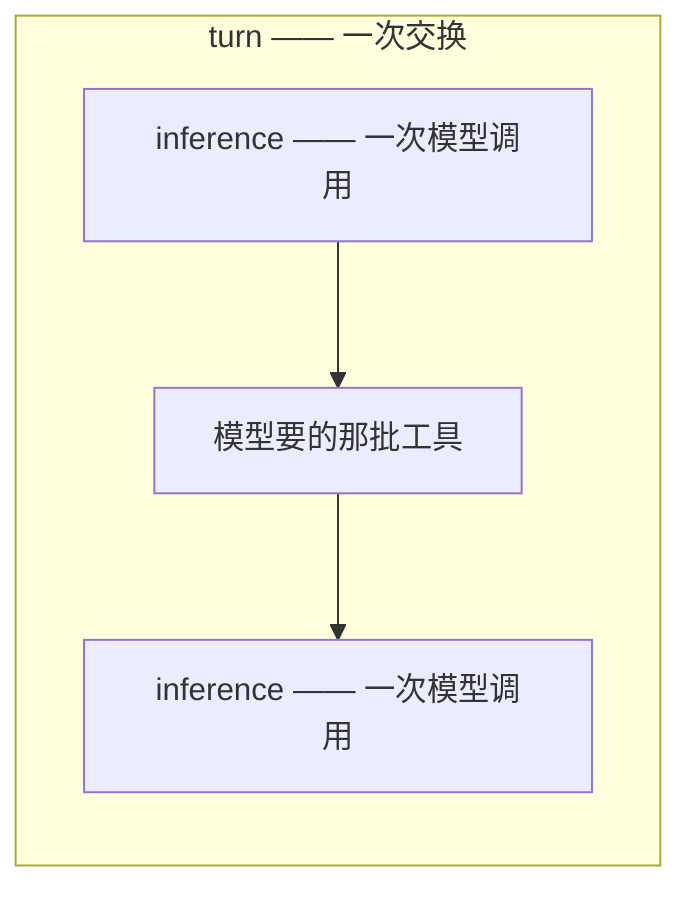
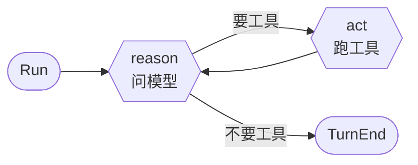
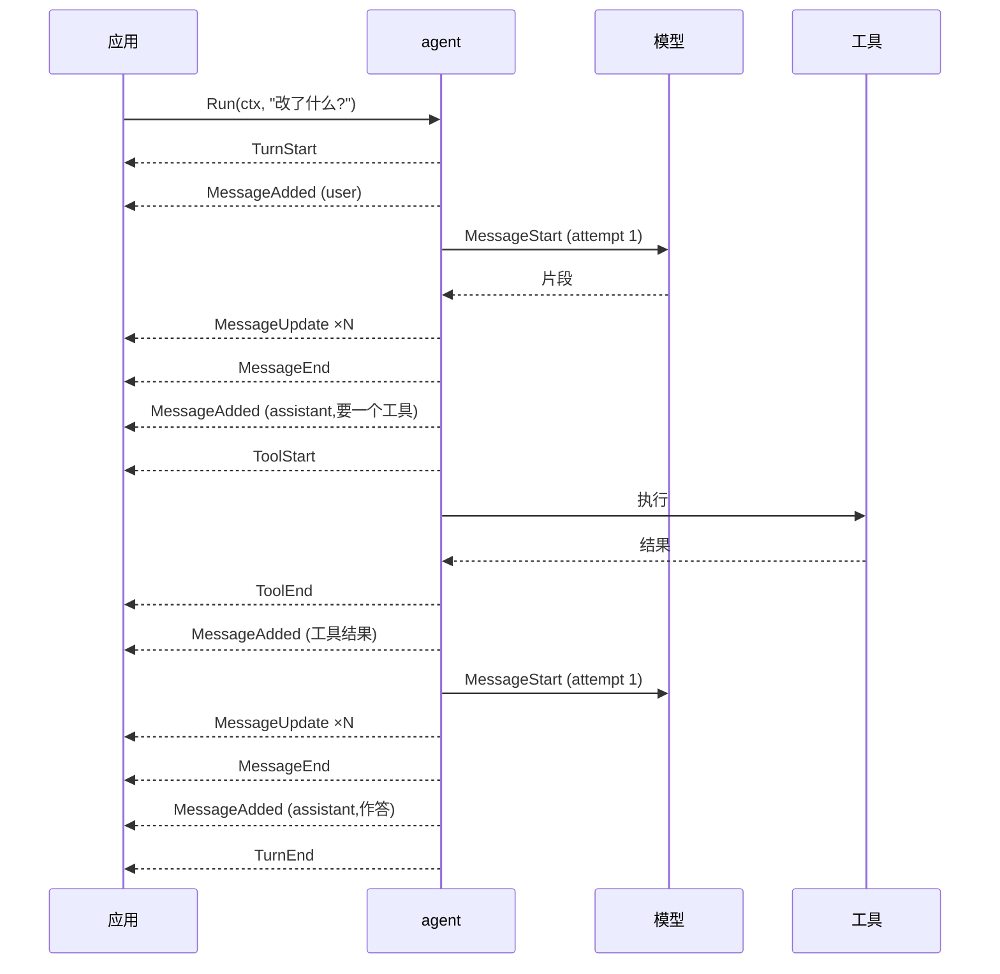
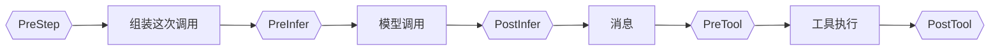
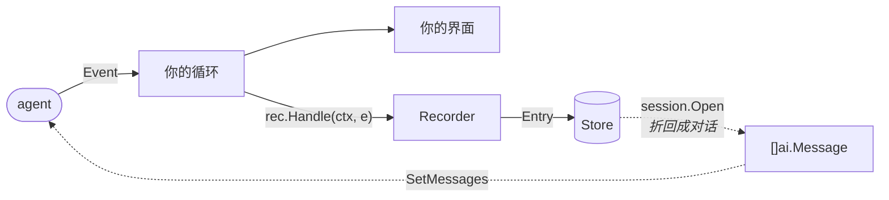

# Agent SDK

`pkg/ai` 负责一次模型调用。`pkg/agent` 负责它外面那圈循环:问模型、跑它要的工具、再问一次,并把沿途发生的每件事作为事件报出来。

一个 agent **一次推进一轮**,并把沿途做的事作为序列报出来:

```go
a, err := agent.New(client,
    agent.WithSystem("You are a careful assistant."),
    agent.WithTools(readFile, listDir),
)

for e, err := range a.Run(ctx, ai.UserMessage("main.go 改了什么?")) {
    render(e)
}
```

**重复它是一个 `for` 循环,而这个循环是应用的**——消息怎么批成一轮、失败了算什么、什么时候停:

```go
for batch := range myMessages {
    for e, err := range a.Run(ctx, batch...) { render(e) }
}
```

CLI 读 stdin,界面读按键,服务端读请求——这些形状这个包猜不到。`AddMessages` 把消息塞进**正在跑的那一轮**,它在下一个 step 边界到达——那是唯一安全改变"模型即将看到什么"的位置。`Interrupt`(或者直接 `break` 出 range)则是结束它。

事件在 range 那条 goroutine 上到达,所以想让 agent 跑在慢读者前面的调用方,自己转发到自己的缓冲里——**多深、满了丢什么,由它决定**。`break` 出 range 就结束这一轮,和 `Interrupt` 一回事。

## 两个层级,两个词

这两个词是精确使用的,因为各家 agent 框架对它们的用法互相矛盾:



| | |
| --- | --- |
| **turn** | 一次交换:有人说了句话,循环一直跑到模型不再要工具为止 |
| **inference** | 一次模型调用;一个 turn 里有多少次,取决于工具要几轮 |

**一个 turn 不等于一次模型调用。** 这里大部分词汇的分野都建立在这个区别上。

## 循环:reason 与 act



`reason` 做一次模型调用,返回它产出的消息。如果这条消息在要工具,`act` 就审查这一批、跑下活着的、把结果喂回去。模型不再要东西、直接作答时,turn 结束。

turn 有八种结束方式,**每个出口都必须说出是哪一种**。失败的 turn 只在这里说一次:`TurnEnd` 带着原因和错误,而迭代器自己的错误留给 turn 之外的失败——今天只有 `ErrBusy`——所以一次失败只被报告一次。

| `StopReason` | |
| --- | --- |
| `end_turn` | 模型直接作答,没要工具 |
| `max_tokens` | 模型的输出配额用完了,**回答是半截的** |
| `refusal` | 模型拒答,或者被内容过滤拦下——可能有文字,但那不是回答 |
| `stop_sequence` | 生成停在 `WithStopSequences` 里的某个序列上 |
| `max_steps` | 步数预算用完,模型还在干活 |
| `terminated` | 这一批工具**全体**要求停 |
| `error` | 模型调用重试到底仍失败,或某个 hook 拒绝 |
| `canceled` | 交换进行中 context 断了,或者调了 `Interrupt` |

### 提前结束一个 turn

**一个什么都不说的流,是唯一一种"看起来像在干活"的故障**,所以 agent 给它设了界:`WithStreamTimeout(first, idle)` 限定端点开口说第一句话的时限、以及开口之后可以停顿多久,默认开启,分别是五分钟和一分钟。超时会被报成**网络错误**——它本来就是——而它正是 `WithRetry` 存在的两个理由之一。

### 被截断的回答可以续写

被输出上限打断的模型**不是答完了,是被打断了** —— 这一轮会以 `max_tokens` 收尾,留下半个答案。`WithContinuation(attempts, prompt)` 改成把 prompt 放进对话、**在同一轮里**再走一步:

```go
agent.WithContinuation(2, "你的回答被输出上限截断了。从你停下的地方继续,不要重复任何内容。")
```

循环知道这件事**什么时候**发生;要不要为更多 token 付费、以及说什么,是你的 —— 所以它**默认关**。这句 prompt 作为普通消息进入对话,并作为 `MessageAdded` 播报,所以会话会记下问了什么。次数用完仍然以 `max_tokens` 收尾:答案本来就是断的。

### 重试归 client

`ai.Retry(attempts, backoff)` 包在 driver 外面,那才是重试该待的地方。**agent 默认不重试**,因为两份预算是相乘不是相加:client 已经 `ai.Retry(3, …)` 了,agent 这边再来三次,一个 step 就是九次模型调用,而且两个循环互相看不见对方的计数。

`WithRetry(attempts, backoff)` 是**显式**再开一份预算,给的是 client replay 不了的两种失败:**已经吐过内容的流**——`ai.Retry` 在这里会放弃,因为它的调用方已经看见了,而这个循环会丢弃这次尝试、另开一条消息——以及**卡住的流**,因为结束一次卡住就会取消掉 `ai.Retry` 要等的那个 context。两种情况下,等待都先看端点给的 `Retry-After`,再退到自己的退避。

`Interrupt()` 结束正在进行的交换,**但 agent 还活着**:这个 turn 以 `StopCanceled` 收尾,`Run` 返回,下一轮干净地开始。这就是用户按 ESC 想要的效果。

它**返回一个 channel**,在那一轮真正结束、agent 重新空闲时关闭。读到按键的那条 goroutine 不是 range `Run` 的那条,看不到循环结束——这就是它知道的方式。

```go
<-a.Interrupt()      // 这一轮结束了,agent 空闲
a.SetMessages(fresh)
```

已经在跑的工具会通过它的 context 被要求停下,然后**被等待**——因为它要经由这次交换汇报。一个不理会取消的工具,会把那个 channel 一直占到它自己返回为止。串行批次则在两个工具之间就停下,而不是把剩下的跑完,每个没跑成的调用都按"已取消"汇报。

交换之间没有东西可中断:channel 已经是关闭的。取消 `Run` 自己的 context 是另一回事,那会结束一切。

## 事件

agent 干的每件事都以 10 种类型之一出现。**有两样东西有值得跟踪的生命周期**——一条消息,一次工具调用——它们的报告方式完全一致:开始、中途可能报告、结束。

```
MessageAdded  MessagesReplaced            对话本身发生变化
MessageStart  MessageUpdate  MessageEnd   模型正在产生一条消息
ToolStart     ToolUpdate     ToolEnd      一次工具调用,从提出到答复
TurnStart                    TurnEnd      包住它们的那一轮
```

这个集合是**封闭**的——`event()` 方法不可导出,别的包加不进来——所以消费者 switch 的时候可以确信上面这张表就是全部。

**对话是第一行的折叠。** 把 `MessageAdded` 按顺序重放,得到的就是 agent 手里那份;遇到 `MessagesReplaced` 则从头开始折——在它之前播报过的一切,都是 agent 已经扔掉的。其余事件报告的都是过程。

**每个属于某一轮的事件都带着轮次号,每个收尾事件都带着开启它的东西**——`MessageEnd` 带着它的 request,`ToolEnd` 带着名字和参数。消费者是从事件上**读出**发生了什么,而不是靠记住之前发生过什么再拼回来;这也是为什么记录一个事件是翻译,不是状态机。

一次交换,从外面看:



### 重试不需要自己的事件

可重试的流失败时,这次尝试以带着错误的 `MessageEnd` 收尾,接着是 `Attempt` 加一的下一个 `MessageStart`。**两者之间没有 `MessageAdded`**——这个"没有"正是告诉消费者:你画出来的那些半截内容作废了。

```
MessageStart(attempt=1) → MessageEnd(err) → MessageStart(attempt=2) → … → MessageEnd → MessageAdded
```

### 什么都不会丢

**什么都不会丢。** 事件在 range 那条 goroutine 上到达,所以不存在会落后的读者——agent 会等循环体跑完。承受不起拖住它的调用方,自己转发到自己的缓冲里,**多深、满了丢什么由它决定**,那才是有足够信息做这个决定的地方。

只有一个例外,也是唯一真正跨 goroutine 的地方:**工具边跑边报的东西**来自工具自己那条 goroutine,它是可丢的——不能为了报进度卡住工具。`ToolEnd` 无论如何都带完整结果。

承受不起拖住 agent 的读者,自己把事件转发到自己的缓冲里——丢弃策略就成了它自己的事。

## Hook

Hook 是应用插进"循环与模型之间"的地方。**事件是通知,hook 是征询**——这也是它们和事件流不共用任何一个词的原因。



| | 收到 | 交回 |
| --- | --- | --- |
| `PreStep` | 对话本身,以及发出去要花多少 | 一份替换(nil 表示保持原样) |
| `PreInfer` | 即将发出的那次调用 | 原地修改 |
| `PostInfer` | 成功调用返回的 response | 原地修改 |
| `PreTool` | 这次调用、它的工具、对话 | 一个 `Decision` |
| `PostTool` | 这次调用、它的工具、产出 | 一个 `*Result`(nil 表示保持原样) |

```go
agent.WithHooks(agent.Hook{
    PreTool: func(ctx context.Context, c agent.PreToolContext) (agent.Decision, error) {
        if c.Tool.Schema().Name == "write_file" && !approved(c.Call) {
            return agent.Decision{Block: true, Reason: "用户没有批准"}, nil
        }
        return agent.Decision{}, nil
    },
})
```

**组合规则**,因为两个互相不同意的门必须有个说法:

- 除 `PreTool` 外都是链式的:每个看到的是前一个改完的结果。
- `PreTool` 按顺序征询,**第一次拒绝即终局**。一个越加越弱的门不是门。
- 每个 hook 都在循环那条 goroutine 上、一次一个,所以**都不需要自己加锁**。
- **返回错误会以 `StopError` 结束这次交换,返回一个"拦下"的 `Decision` 不会。** 错误说的是这个 hook 没能完成自己的活,那是应用的失败,不是模型能绕过去的事;而拦下是一次拒绝,模型会以工具错误的形式被告知,还可以换个别的试。`PreTool` 那两个返回值的全部区别就在这里。
- **hook 里的 panic 不会被兜住**,工具里的会。工具跑在这个包自己创建的 goroutine 上,别人接不住;hook 跑在 range `Run` 的那条 goroutine 上,写它的人自己就能接。交换会带着 panic 解栈,不报告任何结局,agent 回到空闲。

一个 agent 持有的是**多个** hook,不是一个:权限门和审计日志是两件事,不该被迫写成同一个函数。

### `PreInfer` 能改什么

`PreInfer` 拿到的是一个 `Inference`——这个 agent 即将发起的那次调用——**改动只对这一次生效**:

```go
PreInfer: func(_ context.Context, inf *agent.Inference) error {
    if len(inf.Messages) > 200 {
        inf.Messages = inf.Messages[len(inf.Messages)-200:]
    }
    inf.Options = append(inf.Options, ai.WithForceTool("search"))
    return nil
},
```

`Client`、`System`、`Messages`、`Tools` 是 agent 贡献的那部分,这一次调用里归 hook 支配。**其余一切**——为这一步强制某个工具、为这一次答案指定 schema、给这一次调用设上限、某个协议独有的设置——都通过**追加 `Options`** 达成,它是最后叠上去的一层,盖在 client 自己的设置之上。

用这个形状而不用 `ai.Request` 是有原因的:一个**半填的** request 说不清哪些字段是有意为之——对它上面每一个值类型,"没动过"和"特意设成零"是同一串字节,而这正是 `ai.Request.Temperature` 用指针要避开的歧义。追加一个 option 没有这个问题(在就是在,不在就是不在),而且分层本来就是 `pkg/ai` 组装一次调用的方式。

`Client` 是这次调用**打到哪里**——默认是 agent 自己的那个,直到某个 hook 把这一次指向别处:

```go
PreInfer: func(_ context.Context, inf *agent.Inference) error {
    if summarising(inf) {
        inf.Client = cheap
    }
    return nil
},
```

它每次尝试都会重建,所以重试可以发到上一次尝试没去过的地方:**备用端点是一个 hook,不是第二个循环**。传一个你已经持有的 client——`ai.New` 会建一个 driver,而 driver 会带上一整个连接池。

想改 agent 本身而不是某一次调用,用 `SetMessages` / `SetTools` / `SetSystem` / `SetClient`。`SetClient` 就是一个人在会话中途换模型:agent 的其余部分原封不动,变的只是下一次调用去哪里。

### 压缩

一段对话会在**回合中途**撑破窗口——三十次工具调用就够了——所以缩短它的缝是 `PreStep`,在循环可以自由改动对话的那个 step 边界上:

```go
PreStep: func(ctx context.Context, c agent.PreStepContext) ([]ai.Message, error) {
    if c.Tokens < c.Client.Model().ContextWindow*8/10 {
        return nil, nil // nil:什么都不动
    }
    agent.Compacting(ctx) // 这一步要花几秒,说一声
    return summarise(ctx, c.Messages)
},
```

缩短对话本身就是一次模型调用,而一条几秒不说话的流看起来就像卡住了。`agent.Compacting(ctx)` 会在这段等待外面开一个 `CompactionStart` / `CompactionEnd` 的 span——**由 hook 宣布开始**,因为只有决定要压缩的那段代码知道自己即将开始;**由循环负责收尾**,不管 hook 怎么返回,并且带上开场时的那份信息。什么都不宣布的 hook 不产生 span,所以流不会因此每一步多出两个事件。它和工具的 `agent.Report` 一样走 context,所以你调用的那个 summariser 可以替你宣布。

`Tokens` 是整个 prompt 的估算——对话、system prompt,以及十几个就能盖过对话的工具 schema——**每个边界现算,不记住上一次响应报的数**。落后一次调用的数字,对着刚刚替换出来的新对话仍会读作"满",于是要求把它也替换掉。

替换在**当场**以 `MessagesReplaced` 播报,所以会话把这次压缩记在做出它的那一步上,折叠时不会路过一份 agent 早已丢弃的对话。`PreInfer` 是这一对里的另一半:它只改这一次调用,不动对话。


## 工具

一个工具只有两个方法:

```go
type Tool interface {
    Schema() ai.Schema
    Run(ctx context.Context, call ai.ToolCall) (Result, error)
}
```

`ToolFunc` 从 Go 的参数类型直接生成——**发给模型的 schema 和参数解码进的结构体是同一个**,所以两者不可能描述出不同的东西:

```go
readFile := agent.ToolFunc("read_file", "读取工作区里的一个文件。",
    func(ctx context.Context, args struct {
        Path string `json:"path" description:"要读取的路径"`
    }) (agent.Result, error) {
        b, err := os.ReadFile(args.Path)
        if err != nil {
            return agent.Result{}, err
        }
        return agent.TextResult(string(b)), nil
    })
```

返回 error 就是工具失败的方式:循环会把它变成模型看得见、能自己纠正的工具错误,而不是让整个 turn 失败。

**跑得久的工具要边跑边给人看。** `agent.Report(ctx, partial)` 会作为 `ToolUpdate` 到达消费者——命令的输出边出边报、文件列表边走边报。它走 context 而不是参数,**这样没东西可报的工具一分钱都不付**。

**`Result` 把两个受众分开。** `Content` 是告诉模型的;`Details` 是给界面看、模型永远看不到的——一段 diff、一个文件列表、一个退出码。**一个为人排版的工具,最后会把那些排版发给模型,而且此后每一轮都为它付费。**

**一个会回来的界面**——resume 之后重画的那份转录——要自己说留什么:这个值只有它的主人读得懂,一段 diff 或一个列表值得存多少,也只有它的主人知道。

```go
rec, history, err := session.Open(ctx, store, resume, session.WithToolDetails(
    func(e agent.ToolEnd) any { return e.Result.Details }))
```

它原样回到 `ToolRun.Details`,以那次调用的 ID 为键,和恢复出来的对话对得上。**不传这个 option,会话一个字节都不存。**

**并行。** 一批工具默认并发执行。`agent.Sequential(t)` 标记一个不能与别人同时跑的工具,而**一批里只要有一个这样的,整批就串行**——一批工具只有在每个成员都安全时才能并行。

**并行批次里有两种顺序,谁也不能让步。** `ToolEnd` 按**完成顺序**发出,所以界面能在某个工具一停就收掉它的 spinner;而交回给模型的结果按**模型提问的顺序**排列,所以重放一个会话每次得到的是同一份记录。

### 从工具里结束一个 turn

`Result.Terminate` 让这一批跑完之后直接结束 turn,不再把结果拿给模型看。它是**一票**:必须这批里**每一个**调用都要求停,turn 才停。一个工具不能把别人正干到一半的 turn 掐断——那些结果会进对话却永远没人读。门通过 `Decision.Terminate` 投同样的票。

## 会话

**agent 完全不知道存储这回事。** 记录发生在应用自己的事件循环里:

```go
rec, history, err := session.Open(ctx, store, resume)   // "" 表示新开一个
a.SetMessages(history)

for e, err := range a.Run(ctx, msg) {
    rec.Handle(ctx, e)   // 先写盘
    render(e)       // 再画屏
}
```

这个顺序是有讲究的:进程在两者之间被杀,不该留下一条**屏幕上有、文件里没有**的消息。



实线是写路径,虚线是读路径。**两条路在 agent 内部没有任何交点**:它拿到的只是一个 `[]ai.Message`,从头到尾不知道它从哪来。

### 写进去什么

一个 span 只在**收尾时**存一次——收尾事件已经带了完整值,所以不需要把开始事件挂着,片段也根本不存。

| 事件 | 记录 | 为什么 |
| --- | --- | --- |
| `MessageAdded` | `message` | 对话,一次一条 |
| `MessagesReplaced` | `snapshot` | 对话被整体扔掉换了一份 |
| `MessageEnd` | `inference` | 一次模型调用:问了什么、花了多少 |
| `ToolEnd` | `tool` | 一次工具执行 |
| `TurnEnd` | `outcome` | 这一轮怎么结束的,以及为什么 |
| `MessageStart` `MessageUpdate` `ToolStart` `ToolUpdate` `TurnStart` | —— | 收尾事件已经说完了 |

### 读出来什么

恢复就是把这些记录折回去。消息往后追加,**遇到 snapshot 则从头开始折**——因为在它之前播报过的一切,都是 agent 已经丢弃的:

```
seq   1         2         3          4         5         6
      message   message   snapshot   message   message   outcome
                          ▲
                          └─ 折叠从这里开始。1 和 2 已经没了:
                             把它们读回来,等于把压缩掉的历史
                             又塞回给 agent。
```

除 `message` 和 `snapshot` 之外的记录**不参与恢复** —— 它们是用来解释和计费的。每条上面的轮次号是**会话自己的**,不是 agent 的:agent 每次运行都从 1 开始数,`session.Open` 把会话已有的轮数加上去,两边才对得齐。

**换掉对话本身也是一个事件。** 压缩会把整段历史换掉,只折叠 `MessageAdded` 的话,恢复出来的正是你刚扔掉的那份。所以 `SetMessages` 会被**播报**——作为 `MessagesReplaced`,在下一轮交换开始时发出,因为那是 agent 下一次有地方可说的时刻——recorder 把它存成折叠的新起点:

```go
summary := compact(a.Messages())
a.SetMessages(summary)   // 就这一行
```

**没有第二行可以忘。** 之所以推迟到下一轮而不是当场播报:进程如果死在这两者之间,恢复出来的是压缩前的那份对话——那是丢了一次优化,不是坏了一段历史。

`Store` 只有四个方法,而且是刻意的:

```go
type Store interface {
    Create(ctx context.Context, meta Meta) (Meta, error)
    Append(ctx context.Context, id string, entries ...Entry) error
    Entries(ctx context.Context, id string) iter.Seq2[Entry, error]
    Meta(ctx context.Context, id string) (Meta, error)
}
```

列表、改名、分叉、删除是**应用拿着它选定的 store** 干的事,写在那个 store 自己的类型上——`jsonl.Store` 就有这些。**接口只需要写出这个包自己会调的东西。**

## 包结构

```
pkg/agent/
  agent.go     agent 是什么:状态、构造选项、能读能改的东西
  run.go       一次交换:Run,以及它背后 reason/act 的循环
  event.go     10 个事件
  hook.go      4 个 hook,以及每条链怎么跑
  tool.go      Tool、Result、ToolFunc、Sequential
  session/     事件 → 持久条目,以及折回来
    jsonl/     文件系统上的 store,一个会话一个目录
```

## 它不做的事

- **不做 agent 之间的移交。** 一个 agent 是一个模型的一段对话。把多个组合起来是应用的事,而它们的事件流本来就是干这件事的接缝。
- **不做 prompt 组装。** `WithSystem` 收的是一个字符串,因为分层拼装是应用的事,这个包不需要有意见。
- **不读任何环境凭证。** 继承自 `pkg/ai`:没有明确要求,就不会去读环境变量或文件。
- **不定压缩策略。** `SetMessages` 是接缝;什么时候压、保留什么,是你的事。
